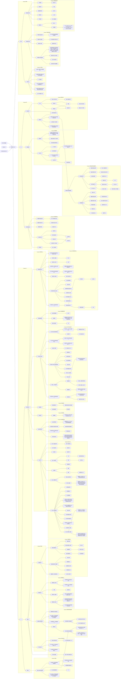

```mermaid
graph LR
    信守明天TRST --> 保单
    信守明天TRST --> 钱
    信守明天TRST --> 人

    
    多元货币储蓄 --> 信守明天TRST
    终身人寿 --> 信守明天TRST
    股东全资分红计划 --> 信守明天TRST
    
    subgraph Subgraph 保单
        保单 --> 保单基本信息
        保单 --> 开枝散叶选项 
        保单 --> 计划终止
    end

    subgraph Subgraph 钱
        钱 --> 保单价值
        钱 --> 身故赔偿
        钱 --> 货币转换选项
    end

    subgraph Subgraph 人
        人 --> 保单持有人 
        人 --> 受保人
        人 --> 投保人
    end

    subgraph Subgraph 保单基本信息
      保单基本信息 --> 计划类型 -->基本计划
      保单基本信息 --> 保障年期 --> 终身
      
      保单基本信息 --> 保费缴费年期 --> 3年/5年
      保单基本信息 --> 投保年龄 --> 1-80岁
      保单基本信息 --> 货币选择 --> 美人港澳加英
      保单基本信息 --> 保费折扣 --> 百分之一
      保费折扣 --> 生效额度 --> 1,000,000美元/8,000,000港元/6,000,000人民币/1,200,000澳元/1,200,000加元/600,000英镑

    end

    subgraph Subgraph 开枝散叶选项

      开枝散叶选项 --> 开枝散叶起始日期 --> 第3个保单年度或保费缴费年期完结
      开枝散叶选项 --> 开枝散叶时间窗口 --> 每个保单周年日的前30天
      开枝散叶选项 --> 保单拆分次数 --> 每保单年度1次
      开枝散叶选项 --> 开枝散叶选项的影响 --> 取消身故赔偿支付选择\指定受益人\以及后续持有人\无行为能力下的指定人士或指定持有人\自主入息收款人和后备受保人的选项
      开枝散叶选项的影响 --> 取消任何自主入息提示
      开枝散叶选项的影响 --> 终止学术优异奖
      开枝散叶选项的影响 --> 分拆的保单不设犹豫期
    end
    subgraph Subgraph 计划终止     
      计划终止 --> 1.受保人身故后,支付身故赔偿
      计划终止 --> 2.保费宽限期仍未缴费,且不足以自保费贷款
      计划终止 --> 3.主动退保
      计划终止 --> 4.无行为能力选项百分之100退款给指人士
      计划终止 --> 5.未偿还保费贷款\利息的总和超过保单现金价值
      计划终止 --> 6.执行开枝散叶计划
    end
    
    subgraph Subgraph 终期红利的锁定解锁
      终期红利的锁定解锁 --> 红利锁定选项 
      红利锁定选项 --> 锁定操作起始日期 --> 第10个保单周年日
      红利锁定选项 --> 锁定操作窗口时间 --> 保单周年日的前30天内
      红利锁定选项 --> 锁定操作频率 --> 每保单年只1次
      红利锁定选项 --> 红利的锁定户口
      红利的锁定户口 --> 锁定百分比--> 10-75    
      红利的锁定户口 --> 锁定百分比总和 --> 小于等于75
      红利的锁定户口 --> 锁定户口利息 --> 利率并非保证,不时厘定
      红利锁定选项 --> 只可以选一项
      
      终期红利的锁定解锁 --> 红利解锁选项       
      红利解锁选项 --> 只能选一项
      红利解锁选项 --> 解锁操作起始日期 --> 红利锁定选项后1年
      红利解锁选项 --> 解锁操作窗口日期 --> 每个保单周年日前30天
      红利解锁选项 --> 解锁操作频率 --> 每保单年执行1次
      红利解锁选项 --> 解锁百分比
      红利解锁选项 --> 户口锁定百分比 --> 维持不变
    end

    subgraph Subgraph 保单价值 
      保单价值 --> 红利 --> 开始公布红利价值 --> 第3个保单周年日
      红利 --> 归原红利
      归原红利 --> 面值
      归原红利 --> 现金价值
      红利 --> 终期红利
      终期红利 --> 面值
      终期红利 --> 现金价值
      面值 -->已经公布,保证派发
      现金价值 --> 即使公布,可升可降
      终期红利 --> 终期红利的锁定解锁
      保单价值 --> 保证的现金价值
      保单价值 --> 退保价值
      退保价值 --> 保证的现金价值
      退保价值 --> +归原红利现金价值+终期红利现金价值
      退保价值 --> +红利锁定户口内款项
      退保价值 --> -任何未缴付保费以及未偿还的贷款和利息
    end


    subgraph Subgraph 身故赔偿 
      身故赔偿 --> 赔偿款项 --> 取最大,保证现金价值+红利面值,已缴保费的105%-提取的现金价值
      赔偿款项 --> +终期红利锁定户口内款项
      赔偿款项 --> -任何未偿还贷款和利息
      
      身故赔偿 --> 支付方式
      支付方式 --> 1.一次性支付
      支付方式 --> 2.每月分期支付
      支付方式 --> 3.一次性支付部分,余额以每月分期支付
      支付方式 --> 4.自主传承 --> 每月分期支付,加指定人生大事时支付
      4.自主传承 --> 1名指定受益人
    end

    subgraph Subgraph 货币转换选项
      货币转换选项 --> 转换操作起始日期 --> 第3个保单周年日起
      货币转换选项 --> 转换操作窗口时间 --> 保单周年日前30天内
      货币转换选项 --> 转换操作频率 --> 每保单年1次
      货币转换选项 --> 总现金价值 -->保持不变
      总现金价值 --> 保证现金价值 --> 汇率兑换
      总现金价值 --> 非保证红利 --> 可升可降
      总现金价值 --> 红利锁定户口内资金 --> 汇率兑换
      货币转换选项 --> 操作影响 --> 自主入息取消
    end


    subgraph Subgraph 保单持有人
        保单持有人 --> 后续保单持有人
        保单持有人 --> 保单缓缴保障
        保单持有人 --> 无行为能力选项
        保单持有人 --> 现金提取
        保单持有人 --> 保单贷款 
        保单持有人 --> 自动保费贷款
        保单持有人 --> 自主入息
    end

    subgraph Subgraph 后续保单持有人
    后续保单持有人 --> 无限次,要求现有保单持有人和受保人在世
      后续保单持有人 --> 后续持有人数量 --> 只1名
      后续保单持有人 --> 后续持有人年龄 --> 18岁
      后续保单持有人 --> 若现有持有人和受保人是同一人 --> 需要同时委任后备受保人和后续持有人
      后续保单持有人 --> 无行为能力选项,委任指定持有人 --> 后续持有人和指定持有人需为同一人
      后续保单持有人 --> 后续持有人资格--> 参考产品的文档
      后续保单持有人 --> 取消后续持有人委任 --> 1.转让保单权益
      取消后续持有人委任 --> 2.转让保单
      取消后续持有人委任 --> 3.更换或取消后续持有人
      取消后续持有人委任 --> 4.后续持有人身故
      取消后续持有人委任 --> 5.行使开枝散叶计划
      取消后续持有人委任 --> 6.取消后背受保人
      后续保单持有人 --> 后续持有人成为新保单持有人
      后续持有人成为新保单持有人 --> 申请成为新持有人 --> 申请时间 --> 180天内
      申请成为新持有人 --> 申请批准周期 --> 30天
    end

    subgraph Subgraph 保单缓缴保障
      保单缓缴保障 --> 延长保费宽限期 --> 365天
      保单缓缴保障 -->适用事件-->结婚\离婚\生育\领养子女\买入住宅物业\移居另一城市\非自愿性失业
      保单缓缴保障 -->缓交适用次数 --> 1次
    end
    
    subgraph Subgraph 无行为能力选项
      无行为能力选项 --> 1.无行为能力选项保障支付 
      1.无行为能力选项保障支付 --> 预先指定人士'持有人也是受保人 --> 同时指定支付百分比
      1.无行为能力选项保障支付 --> 支付款项 --> 无行为能力确诊
      无行为能力选项 --> 2.无行为能力选项保单权益转让
      2.无行为能力选项保单权益转让 --> 指定无行为能力时特定持有人
      2.无行为能力选项保单权益转让 --> 指定持有人与后续持有人需为同一人
      无行为能力选项 -->选项执行次数 --> 同一保单只执行一次
      无行为能力选项 --> 取消无行为能力选项的理由 --> 1.更换受保人
      取消无行为能力选项的理由 --> 2.保单已被终止
      取消无行为能力选项的理由 --> 3.转让保单权益
      取消无行为能力选项的理由 --> 4.转让保单
      取消无行为能力选项的理由 --> 5.行使开枝散叶选项
      取消无行为能力选项的理由 --> 6.持有人订立遗嘱
      取消无行为能力选项的理由 --> 7.持有人破产
      无行为能力选项 --> 指定人士作出索偿
      指定人士作出索偿 --> 索偿资格 --> 1.保单生效期间保单持有人确诊受保疾病
      索偿资格 --> 2.指定人士委任仍然生效
      索偿资格 --> 3.持有人\制定人士在世
      指定人士作出索偿 -->索偿金额 --> 索偿获批当天的退保价值的百分比
      无行为能力选项 --> 指定持有人成为新保单持有人
      指定持有人成为新保单持有人 --> 转正资格 --> 1.保单生效期间保单持有人人确诊受保疾病
      转正资格 --> 2.指定持有人还在世
    end
    
    subgraph Subgraph 现金提取

      现金提取 -->现金提取方式 --> 1.提取现金价值2.部分退保
      现金提取 -->现金提取顺序 --> 1.终期红利锁定户口2.归原红利的现金价值,名义金额保持不变3.终期红利的现金价值(部分退保)
    end
    
    subgraph Subgraph 保单贷款
      保单贷款 --> 贷款额度 -->保证现金价值+归原红利现金价值的百分之80
     end
    
    subgraph Subgraph 自动保费贷款
      自动保费贷款 --> 自动保费日期 --> 保费到期日后1个月之内无法获得保费缓缴资格
      自动保费贷款 --> 保单现金价值足够支付保费 --> 自动保费贷款,保单继续
      自动保费贷款 --> 保单现金价值不足够支付保费 --> 保单自动终止
      自动保费贷款 --> 保单现金价值 -->本保单的保证现金价值和归原红利的现金价值总和,扣除任何未向我们偿还的保单贷款和利息
    end
    
    subgraph Subgraph 自主入息
      自主入息 --> 自主入息起始日期 --> 第5个保单年度
      自主入息 --> 支付开始时间 --> 客户指定
      自主入息 --> 支付频率 --> 每月/每年
      自主入息 --> 自主入息收款人 --> 1名 --> 无限次取消和设立
      自主入息 --> 入息款项 --> 定额
      入息款项 --> 递增 --> 递增年利率1-10
      自主入息 --> 自主入息提取方式 --> 维持名义金额不变
      维持名义金额不变 --> 提取顺序1.红利锁定户口2.归原红利的非保证价值
      自主入息提取方式 --> 减少名义金额
      减少名义金额 --> 提取顺序1.红利锁定户口2.归原红利的非保证现金价值3.终期红利的非保证现金价值4.保证现金价值
      自主入息收款人 --> 年龄 --> 18岁或以上
      自主入息收款人 --> 合资格条件
      自主入息 --> 自主入息取消条件 --> 1.保单权益转让
      自主入息取消条件 --> 2.保单被终止
      自主入息取消条件 --> 3.支付期结束
      自主入息取消条件 --> 4.维持名义金额不变的情况,红利锁定户口和归元红利的非保障现金价值不足
      自主入息取消条件 --> 5.减少名义金额的情况,名义金额低于最低标准
      自主入息取消条件 --> 6.转让保单
      自主入息取消条件 --> 7.行使开枝散叶选项
      自主入息取消条件 --> 8.行使货币转换选项
      自主入息取消条件 --> 9.取消自主入息指示或自主入息收款人
      自主入息取消条件 --> 10.保单持有人身故
      自主入息取消条件 --> 自主入息受保人身故
      自主入息受保人身故 --> 1.后备受保人成为新受保人,继续支付自主入息款项
      自主入息受保人身故 --> 2.需要支付身故赔偿时,扣除身故当天至收到身故赔偿通知期间所支付的入息款项

    end

    subgraph Subgraph 受保人
        受保人 --> 后备受保人
        受保人--> 更换受保人
        受保人 --> 延伸意外身故保障
        受保人 --> 学术优异奖 
    end

    subgraph Subgraph 后备受保人
      后备受保人 --> 委任后备受保人 --> 无限的次数
      委任后备受保人 --> 委任后背受保人次数 -->每年1次
      委任后备受保人 --> 合资格要求 --> 参考产品文档
      委任后备受保人 --> 若无后备受保人 --> 支付身故赔偿
      后备受保人 --> 取消后备受保人的理由 --> 1.转让保单
      取消后备受保人的理由 --> 2.更换受保人
      取消后备受保人的理由 --> 3.后备受保人身故
      取消后备受保人的理由 --> 4.开枝散叶计划
      后备受保人 --> 后备受保人成为新受保人 --> 180天之内申请
    end

    subgraph Subgraph 更换受保人     
      更换受保人 --> 更换受保人场景
      更换受保人场景 --> 1.保单期间内且现有受保人在世
      更换受保人场景 --> 2.现有受保人去世,后备受保人转正
      更换受保人 --> 次数 --> 无限次数
      更换受保人 --> 新受保人合资格
      更换受保人 --> 更换受保人成功 --> 1.基本计划保障年期调整为新受保人终身
      更换受保人成功 --> 2.取身故赔偿选择\指定受益人\无行为能力下的制定人士\后备受保人
      更换受保人成功 --> 3.终止延伸意外身故保障和学术优异奖
    end

    subgraph Subgraph 延伸意外身故保障  

      延伸意外身故保障 --> 保障金额会支付给受益人
      延伸意外身故保障 --> 同一受保人名下所有保单的延伸意外身故保障为125,000美元
      延伸意外身故保障 --> 一旦更换受保人,此保障即终止
        延伸意外身故保障 --> 保障支付
      保障支付 --> 支付延伸意外+身故赔偿--> 1.意外发生后90天内去世
      支付延伸意外+身故赔偿--> 2.第5个保单周年日之前
      保障支付 --> 只支付延伸意外身故保障 --> 1.意外身故的受保人和保单持有人为同一人
      只支付延伸意外身故保障 --> 或2.受保人和保单持有人不是同一人,但是在同一意外中身故
    end

    subgraph Subgraph 学术优异奖 
      学术优异奖 --> 学术优异奖合资格 --> 17-25岁,保单生效至少一年
      学术优异奖 --> 同一受保人名下所有保单,只可享受一次
      学术优异奖 --> 一旦开枝散叶或更换受保人,即终止
      受保人 -->总年度化保费 -->其名下所有不同保单合并
    end


    subgraph Subgraph 投保人
      投保人 --> 投保人意外身故保障
      投保人意外身故保障 --> 支付投保人意外身故保障+身故赔偿-->1.意外发生后90天内,因意外去世
      支付投保人意外身故保障+身故赔偿-->2.保费缴费年期结束前
      投保人意外身故保障 --> 只支付延伸意外身故保障
      投保人意外身故保障 --> 投人意故保障金额-->???
      投保人意外身故保障 --> 同一持有人名下所有生效保单的延伸意外身故保障为125,000美元
    end
```